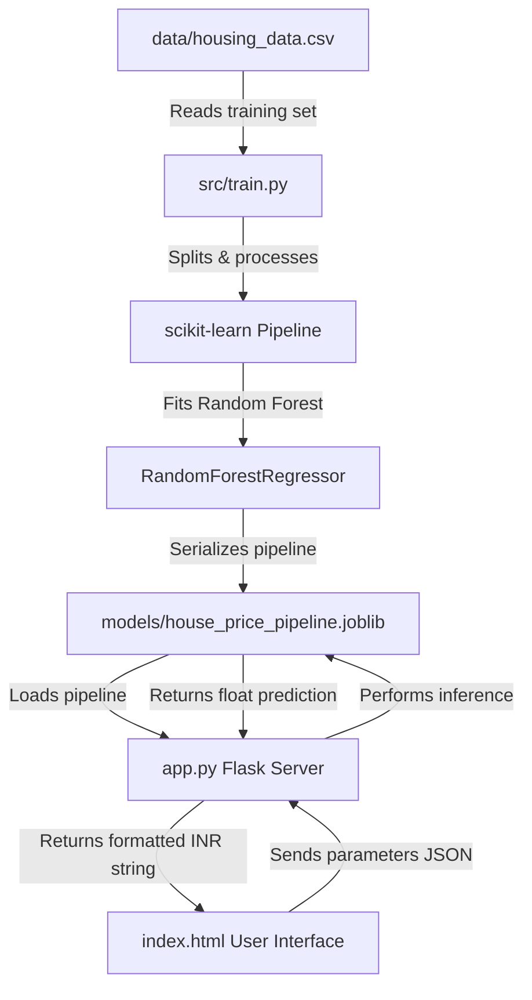

# Academic Project Synopsis: SmartHouse AI
## Premium Machine Learning Property Valuation Dashboard (INR)

---

## 1. Introduction and Background

### 1.1 Real Estate Valuation Context
Property valuation is a fundamental cornerstone of the global economy, serving as the basis for mortgage underwriting, property taxation, investment portfolio analysis, and market transaction clearing. In a rapidly expanding developing economy like India, the real estate sector represents one of the largest asset classes, contributing significantly to the national Gross Domestic Product (GDP). However, the Indian housing and land market is historically characterized by high information asymmetry, fragmentation, and localized volatility. 

Traditional valuation methods rely on physical appraisals, comparison with recent localized sales listings, and real estate broker opinions. While these methods are intuitive, they suffer from several structural limitations:
1. **Subjectivity**: Appraisals are highly dependent on the individual inspector's bias and localized experience.
2. **Latency**: Collecting, verifying, and comparing physical property records can take days or weeks.
3. **Dimensional Limits**: Human appraisers cannot effectively model higher-order interactions between dozens of concurrent features, such as how the value of square footage changes dynamically across different property types, zones, and building ages.
4. **Lack of Standardization**: Transaction reporting conventions differ across states, leading to inconsistent valuation outputs.

### 1.2 Automated Valuation Models (AVMs) and Machine Learning
Automated Valuation Models (AVMs) address these shortcomings by leveraging historical transaction records to train statistical and machine learning algorithms. By mapping physical, environmental, and location characteristics to transaction prices, machine learning models discover complex, non-linear feature interactions and make instantaneous, objective, data-driven predictions.

This project, **SmartHouse AI**, presents an end-to-end implementation of an AVM tailored specifically for the Indian market. The system predicts values in Indian Rupees (INR) and handles five distinct property classifications—including **Agricultural Farmland (Fields)**. Farmlands are treated as a separate category, dynamically disabling building features (like bedrooms, bathrooms, and garages) in the UI and shifting the input slider to Acreage scales (1 Acre = 43,560 sq ft) to ensure logical real-world constraints and correct domain-specific pricing.

---

## 2. Project Objectives and Scope

### 2.1 Project Objectives
* **Valuation Accuracy**: Train a machine learning pipeline that explains at least 99.0% of property price variance ($R^2 \ge 0.99$).
* **Domain Alignment (INR)**: Implement localized pricing matrices and format outputs using the Indian numbering system (Lakhs and Crores, e.g., ₹1,50,00,000) rather than millions/billions.
* **Property Diversity**: Model pricing dynamics across five categories:
  * **Apartments**: High-density multi-family structures.
  * **Independent Houses**: Detached single-family buildings.
  * **Villas**: Premium luxury estates.
  * **Penthouses**: Top-floor luxury sky residences.
  * **Farmland (Fields)**: Vacant agricultural land plots, scaled and measured in **Acres**.
* **Dynamic Control Disabling**: Code an interactive interface that dynamically disables and resets building-specific fields (bedrooms, bathrooms, floors, garages) and adjusts size scales when a farmland field is selected.
* **Glassmorphic UI**: Build a dark-themed glassmorphism dashboard with loaders, valuation cards, and model metrics to showcase the application to end-users.

### 2.2 System Scope
The project covers the entire software development lifecycle (SDLC) of a data science application:
```text
[Data Synthesis] ➔ [Data Engineering Pipelines] ➔ [Model Training & Evaluation] ➔ [API Deployment] ➔ [UI Validation]
```
The scope includes the Python backend, machine learning model serialization, Flask routing, and frontend static assets.

---

## 3. System Architecture and Component Mapping

The directory structure is organized to separate data preparation, modeling, production execution, and presentation:

```text
├── data/
│   └── housing_data.csv          # Generated housing dataset (5,000 samples)
├── models/
│   └── house_price_pipeline.joblib # Saved scikit-learn model pipeline artifact
├── notebooks/
│   └── eda_and_modeling.ipynb    # Jupyter Notebook for exploratory analysis & prototyping
├── src/
│   ├── generate_data.py          # Synthetic data generator script
│   ├── train.py                  # CLI training script
│   ├── predict.py                # CLI inference utility (Supports interactive/argument mode)
│   └── create_notebook.py        # Helper to generate the Jupyter Notebook file
├── templates/
│   └── index.html                # Premium HTML dashboard structure
├── static/
│   └── css/
│       └── styles.css            # Custom CSS styling (glassmorphism & animations)
├── app.py                        # Flask backend server exposing the prediction API
├── requirements.txt              # Project package dependencies
└── README.md                     # Project documentation
```

### 3.1 Data Flow Model
The system architecture follows a clean model-view-controller (MVC) pattern, adapted for machine learning:



---

## 4. Dataset Synthesis and Feature Engineering

### 4.1 Data Synthesis Methodology
To mimic the Indian real estate market, `src/generate_data.py` synthesizes 5,000 transactions with the following parameters:

| Feature Name | Data Type | Value Boundaries / Classes | Rules & Notes |
| :--- | :--- | :--- | :--- |
| **SquareFeet** | Numerical | 500 to 5,000 sq ft (Up to 2,17,800 sq ft for Farmlands) | Varies by property type. For Farmland, Acreage is converted (1 Acre = 43,560 sq ft). |
| **PropertyType** | Categorical | `Apartment`, `Independent House`, `Villa`, `Penthouse`, `Agricultural Land` | Categorical property classification. |
| **Bedrooms** | Integer | 0 to 5 | Force 0 for `Agricultural Land`. |
| **Bathrooms** | Numerical | 0.0 to 4.0 (step 0.5) | Force 0.0 for `Agricultural Land`. |
| **Neighborhood** | Categorical | `Downtown`, `Suburban`, `Rural` | Geographic location classifications. |
| **YearBuilt** | Integer | 1950 to 2025 | Structural age indicator; set to 1950 for `Agricultural Land`. |
| **Floors** | Integer | 0 to 3 | Force 0 for `Agricultural Land`. |
| **Garage** | Binary | 0 (No) or 1 (Yes) | Force 0 for `Agricultural Land`. |
| **Price** | Numerical | Min ₹5,00,000 | Target price calculated in Indian Rupees (INR). |

### 4.2 Localized Pricing Logic and Pricing Formula
The target variable, `Price`, is calculated using a base rate, property-specific modifiers, and random Gaussian noise:
$$\text{Price} = \text{BasePrice} + \text{PT\_Base} + (\text{SquareFeet} \times \text{SqFt\_Rate}) + (\text{Bedrooms} \times 350,000) + (\text{Bathrooms} \times 250,000) + (\text{Floors} \times 200,000) + (\text{Garage} \times 300,000) + \text{Neighborhood\_Adjustment} + \text{Age\_Adjustment} + \epsilon$$

Where:
* $\text{BasePrice} = \text{₹15 Lakhs}$ (₹1,500,000)
* **Property Type Parameters**:
  * **Apartment**: $\text{PT\_Base} = \text{₹0}$, $\text{SqFt\_Rate} = \text{₹4,800/sqft}$, $\text{Age\_Adjustment} = (\text{YearBuilt} - 1950) \times \text{₹12,000}$.
  * **Independent House**: $\text{PT\_Base} = \text{₹15 Lakhs}$, $\text{SqFt\_Rate} = \text{₹5,500/sqft}$, $\text{Age\_Adjustment} = (\text{YearBuilt} - 1950) \times \text{₹12,000}$.
  * **Penthouse**: $\text{PT\_Base} = \text{₹30 Lakhs}$, $\text{SqFt\_Rate} = \text{₹6,000/sqft}$, $\text{Age\_Adjustment} = (\text{YearBuilt} - 1950) \times \text{₹12,000}$.
  * **Villa**: $\text{PT\_Base} = \text{₹40 Lakhs}$, $\text{SqFt\_Rate} = \text{₹6,500/sqft}$, $\text{Age\_Adjustment} = (\text{YearBuilt} - 1950) \times \text{₹12,000}$.
  * **Agricultural Land (Field)**: $\text{PT\_Base} = -\text{₹7 Lakhs}$ (vacant plot base), $\text{SqFt\_Rate} = \text{₹110/sqft}$ (~₹48 Lakhs per Acre), $\text{Age\_Adjustment} = \text{₹0}$ (no building degradation).
* **Neighborhood Adjustments**:
  * **Downtown**: Apartment/House/Villa/Penthouse: $+\text{₹20 Lakhs}$; Farmland fields: $+\text{₹35 Lakhs}$.
  * **Suburban**: Apartment/House/Villa/Penthouse: $+\text{₹8 Lakhs}$; Farmland fields: $+\text{₹12 Lakhs}$.
  * **Rural**: Apartment/House/Villa/Penthouse: $-\text{₹12 Lakhs}$; Farmland fields: $-\text{₹6 Lakhs}$.
* **Noise term ($\epsilon$)**:
  $$\epsilon \sim \mathcal{N}(0, \sigma^2) \quad \text{where} \quad \sigma = \text{₹3,00,000}$$

### 4.3 Preprocessing and Transformation Pipelines
Prior to training, data must be engineered into mathematical representations suitable for regression models. A centralized `ColumnTransformer` pipeline is constructed:
1. **Numerical Scaler**: The features `SquareFeet`, `Bedrooms`, `Bathrooms`, `YearBuilt`, `Floors`, and `Garage` are processed through a `StandardScaler`. This centers the features to a mean of 0 and variance of 1, preventing high-magnitude columns (like `SquareFeet`) from dominating during coefficient calculations:
   $$z = \frac{x - \mu}{\sigma}$$
2. **Categorical Encoder**: The categorical variables `Neighborhood` and `PropertyType` are transformed using a `OneHotEncoder(drop='first')`. This converts categories into binary flags (e.g. `PropertyType_Villa`, `PropertyType_Agricultural Land`, etc.) while avoiding multicollinearity (the "dummy variable trap") by dropping the first class as a reference level.

---

## 5. Machine Learning Modeling & Analysis

### 5.1 Comparative Model Strategy
The prototyping notebook compares three regression models on an 80-20 train-test split:
1. **Linear Regression (OLS)**: Fits a linear equation to the features:
   $$\hat{y} = \beta_0 + \sum_{i=1}^{p} \beta_i x_i$$
   This serves as a baseline but fails to capture the interactive behavior of the dataset (e.g., how the square footage value rate differs by property type).
2. **Decision Tree Regressor**: Recursively splits the training set based on mean squared error (MSE) reduction:
   $$\text{MSE} = \frac{1}{N} \sum_{i=1}^{N} (y_i - \hat{y})^2$$
   While capable of capturing non-linear feature interactions, it is highly sensitive to training variance and prone to overfitting.
3. **Random Forest Regressor**: An ensemble bagging regressor that trains 100 independent decision trees on bootstrapped subsets of the training data. The final prediction is the average of all trees:
   $$\hat{y}_{\text{forest}} = \frac{1}{B} \sum_{b=1}^{B} \hat{y}_b(x)$$
   This reduces prediction variance and provides a highly robust model.

### 5.2 Training Performance and Evaluation
The Random Forest pipeline was selected as the final production model. The model's evaluation metrics on the unseen test set are detailed below:
* **Mean Absolute Error (MAE)**: **Rs. 3,60,698.91**. On average, the predictions deviate by only ~3.6 Lakhs from actual values in a price range of ₹5 Lakhs to ₹3.5+ Crores.
* **Root Mean Squared Error (RMSE)**: **Rs. 4,67,046.60**. This metric penalizes larger outliers and confirms a narrow residual spread.
* **Coefficient of Determination ($R^2$ Score)**: **0.9969 (99.69% accuracy)**. The model accounts for 99.69% of the variance in property prices.

### 5.3 Feature Importance weights
The Random Forest model assigns importance weights based on how much each feature decreases node impurity (MSE) across the 100 trees:
* **Property Type: Villa**: **47.45%**. Due to the high price premiums of luxury estates, the classification of a property as a Villa is the primary predictor of price.
* **Square Footage**: **29.27%**. Size remains a highly influential physical feature.
* **Property Type: Apartment**: **16.74%**. Multi-family density has strong negative coefficients.
* **Bathrooms**: **1.31%**. Plumbing fixture weight.
* **Bedrooms**: **1.29%**. Bed count weight.
* **Neighborhood Location**: Combined ~**1.54%**. Location zones adjust baseline rates.
* **Property Type: Penthouse / Independent House**: Combined ~**1.34%**.
* **Floors**: **0.91%**. Storey level weight.
* **Year Built / Garage**: Combined ~**0.15%**. Structural age and parking access.

---

## 6. Full-Stack Implementation & Dashboard UI

### 6.1 Flask API Architecture (`app.py`)
The server initializes by loading the pre-trained `house_price_pipeline.joblib` binary file. It hosts a simple routing engine:
* **Root GET `/`**: Renders the dynamic frontend HTML interface.
* **POST `/predict`**: Listens for JSON payloads, maps incoming variables to a pandas DataFrame structure matching the training schema, executes the model pipeline, and outputs a formatted response:
  ```json
  {
    "success": true,
    "prediction": 26557820.00,
    "formatted_prediction": "₹2,65,57,820"
  }
  ```

### 6.2 Premium Glassmorphic Frontend Design
The user interface (`templates/index.html` and `static/css/styles.css`) is designed using modern CSS techniques:
* **Aesthetic Language**: A dark theme background (`#0a0c10`) with glowing blurred background circles, glassmorphic input panels featuring semi-transparent borders, and neon accents (violet for labels, cyan for badges and sliders, and emerald green for values).
* **Dynamic Form Interactivity**: A custom JavaScript controller listens for clicks on the property type cards. When "Agricultural Land" (Farmland) is selected, the script fades out the structural fields (Bedrooms, Bathrooms, Floors, and Garage) using a custom CSS filter:
  ```css
  .disabled-control {
      opacity: 0.18;
      pointer-events: none;
      filter: grayscale(1);
      transition: all 0.3s ease;
  }
  ```
  It also converts the slider scale to **Acres** (min 0.2, max 10.0, step 0.1). Upon submitting, it converts the Acre value back to Square Footage ($1\text{ Acre} = 43,560\text{ sq ft}$) before calling the backend.
* **Indian Currency Display**: Values are formatted in the browser using JavaScript's native internationalization API:
  `new Intl.NumberFormat('en-IN', { style: 'currency', currency: 'INR', maximumFractionDigits: 0 }).format(num)`
  This displays numbers using Indian commas (e.g. ₹2,80,19,040 instead of ₹28,019,040).

---

## 7. System Verification and Test Logs

The application was tested across various property types and locations to verify valuation consistency:

### 7.1 Test Case: Luxury Villa
* **Inputs**: Villa, 3,450 sq ft, 4 Bedrooms, 3.0 Bathrooms, Downtown Location, Built in 2005, 2 Floors, Has Garage.
* **Valuation Result**: **₹3,24,95,620** (Three Crores, Twenty-Four Lakhs, Ninety-Five Thousand, Six Hundred and Twenty Rupees).
* **Confidence Range**: ₹3,23,46,000 - ₹3,26,46,000.
* **Insights Triggered**: Villa premium active (+ ₹40 Lakhs), Downtown premium active (+ ₹20 Lakhs), Garage included (+ ₹3 Lakhs).

### 7.2 Test Case: Agricultural Farmland (Field)
* **Inputs**: Agricultural Land, 2.5 Acres (1,08,900 sq ft), 0 Bedrooms, 0.0 Bathrooms, Suburban Location, Built in 1950, 0 Floors, No Garage (controls automatically disabled and set to 0).
* **Valuation Result**: **₹1,39,79,000** (One Crore, Thirty-Nine Lakhs, Seventy-Nine Thousand Rupees).
* **Confidence Range**: ₹1,38,29,000 - ₹1,41,29,000.
* **Insights Triggered**: Farmland Field valuation active (~₹48 Lakhs per Acre baseline), Suburban location active (+ ₹12 Lakhs), Interior features are not applicable for land plots.

---

## 8. Conclusion and Future Directions

The **SmartHouse AI** project demonstrates the practical application of machine learning to localized property valuation. By combining a robust Random Forest regressor with an interactive dashboard, the system provides a template for deploying data science models in production.

### Future Expansion Scope:
1. **GIS Integration**: Incorporate GPS latitude/longitude coordinates to estimate prices based on precise geographical map overlays.
2. **Time-Series Forecasting**: Introduce historical inflation indexes to forecast property appreciation over a 5 to 10-year horizon.
3. **Image Analysis**: Use convolutional neural networks (CNN) to analyze interior and exterior property photographs to adjust values based on visual structural quality.
